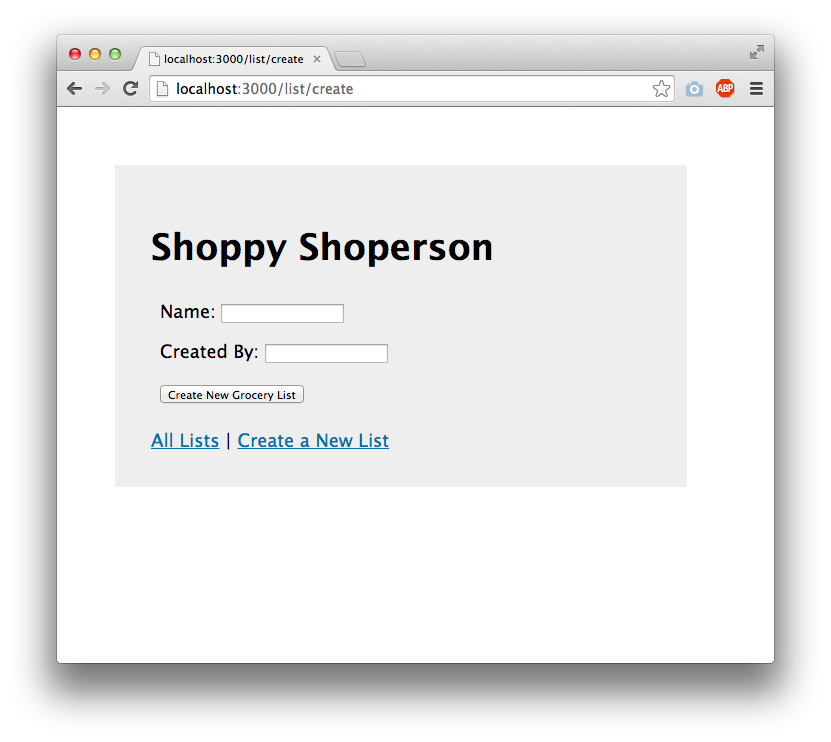
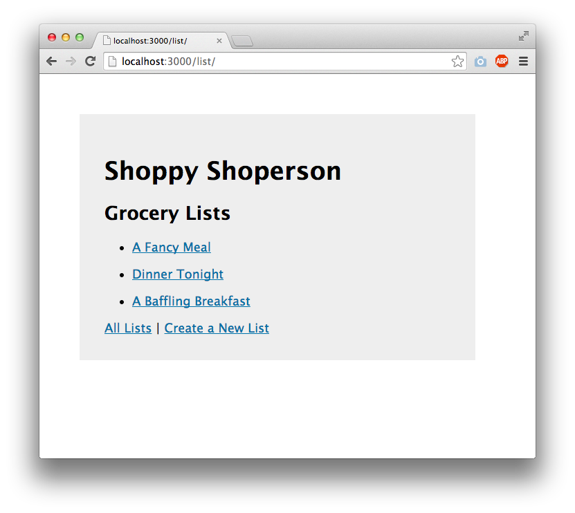
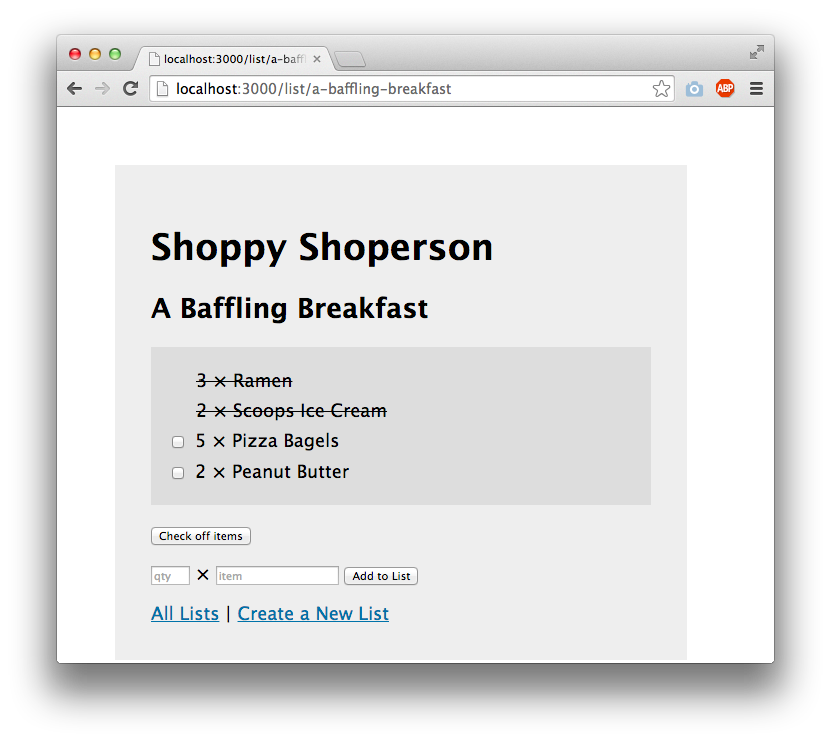

# What to Eat Today? 

## Overview

Deciding what to cook every day can be a hassle, especially when trying to balance nutrition, taste preferences, and variety. "What to Eat Today?" simplifies this daily decision-making process. This web application provides users with daily meal suggestions based on their dietary needs, taste preferences, and the ingredients they have on hand. Users can register to personalize their experience, save favorite recipes, generate shopping lists based on the weekly meal plan, and learn new recipes that fit their lifestyle.


## Data Model

The application will store Users, Recipes, and Preferences:

  * Users have preferences and a list of liked and disliked recipes (via references).
  * Recipes can be liked or disliked by multiple users (via references).
  * Preferences are used to filter and suggest recipes to the user.

(__TODO__: sample documents)

An Example User:

```javascript
{
  username: "foodieuser123",
  hash: // a password hash,
  preferences: // a reference to a Preferences document,
  likedRecipes: // an array of references to Recipe documents,
  dislikedRecipes: // an array of references to Recipe documents
}

```

An Example Recipe:

```javascript
{
  title: "Creamy Tomato Pasta",
  ingredients: ["tomato", "pasta", "cream", ...],
  dietaryRestrictions: ["vegetarian"],
  preparationTime: 30,
  likes: 150, // number of likes
  dislikes: 10 // number of dislikes
}
```

An Example Preferences:

```javascript
{
  user: // a reference to a User object,
  dietaryRestrictions: ["vegan", "gluten-free"],
  dislikedIngredients: ["nuts", "dairy"],
  preferredCuisines: ["Italian", "Mexican"],
  maxPreparationTime: 60 // in minutes
}

```


## [Link to Commented First Draft Schema](db.mjs) 


## Wireframes

(__TODO__: wireframes for all of the pages on your site; they can be as simple as photos of drawings or you can use a tool like Balsamiq, Omnigraffle, etc.)

/list/create - page for creating a new shopping list



/list - page for showing all shopping lists



/list/slug - page for showing specific shopping list



## Site map

(__TODO__: draw out a site map that shows how pages are related to each other)

Here's a [complex example from wikipedia](https://upload.wikimedia.org/wikipedia/commons/2/20/Sitemap_google.jpg), but you can create one without the screenshots, drop shadows, etc. ... just names of pages and where they flow to.

## User Stories or Use Cases

1. As a non-registered user, I can register a new account with the site.
2. As a user, I can log in to the site.
3. As a user, I can set my dietary preferences.
4. As a user, I can view the recipe of the day tailored to my preferences.
5. As a user, I can like/dislike recipes to improve future suggestions.
6. As a user, I can view and manage my favorite recipes.

## Research Topics

* (3 points) Unit testing with Mocha/Chai for backend logic.
    * Writing tests for user authentication, preference saving, and recipe suggestion logic.
* (2 points) Client-side form validation with custom JavaScript.
    * Ensuring all forms have proper input validation before being sent to the server.
* (5 points) Integration of an external API for recipe data.
    * Utilizing the Spoonacular API to get recipes and nutritional facts for suggestions


## [Link to Initial Main Project File](app.mjs) 

(__TODO__: create a skeleton Express application with a package.json, app.mjs, views folder, etc. ... and link to your initial app.mjs)

## Annotations / References Used

(__TODO__: list any tutorials/references/etc. that you've based your code off of)

1. [passport.js authentication docs](http://passportjs.org/docs) - (add link to source code that was based on this)
2. [tutorial on vue.js](https://vuejs.org/v2/guide/) - (add link to source code that was based on this)

