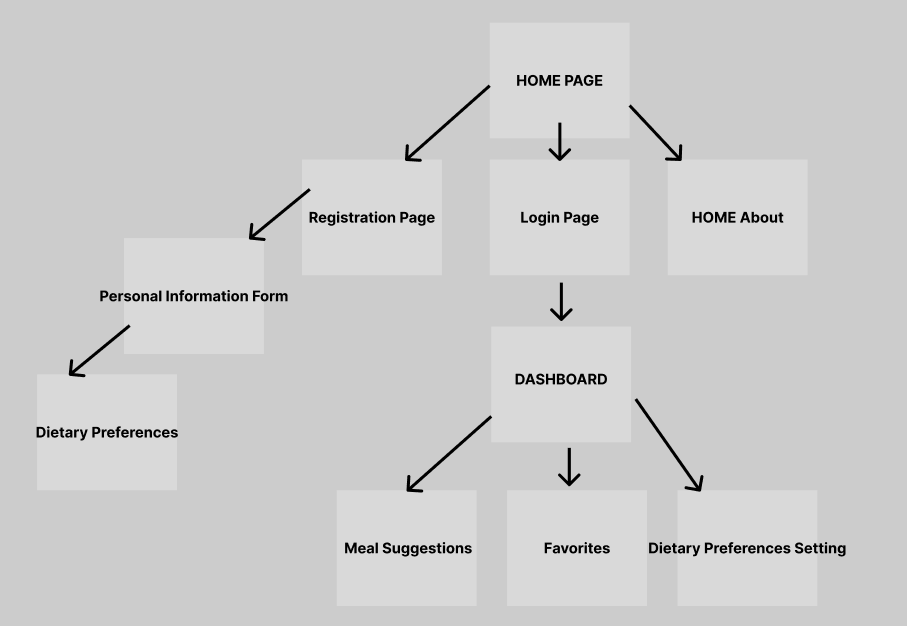

# [What to Eat Today?](https://whattoeat-f3667d115c2c.herokuapp.com/)

## Overview

Deciding what to cook every day can be a hassle, especially when trying to balance nutrition, taste preferences, and variety. "What to Eat Today?" simplifies this daily decision-making process. This web application provides users with daily meal suggestions based on their dietary needs, taste preferences, and the ingredients they have on hand. Users can register to personalize their experience, save favorite recipes, generate shopping lists based on the weekly meal plan, and learn new recipes that fit their lifestyle.


## Data Model

The application will store Users, Recipes, and Preferences:

  * Users have preferences and a list of liked and disliked recipes (via references).
  * Recipes can be liked or disliked by multiple users (via references).
  * Preferences are used to filter and suggest recipes to the user.


An Example User:

```javascript
{
  username: "foodieuser123",
  hash: // a password hash,
  preferences: // a reference to a Preferences document,
  likedRecipes: // an array of references to Recipe documents,
  dislikedRecipes: // an array of references to Recipe documents
}

```

An Example Preferences:

```javascript
{
  user: // a reference to a User object,
  dietaryRestrictions: ["vegan", "gluten-free"],
  dislikedIngredients: ["nuts", "dairy"],
  preferredCuisines: ["Italian", "Mexican"],
  minProtien: 60 // in g
}

```


## [Link to Commented First Draft Schema](db.mjs) 


## Wireframes


/ - landing page


/signup - page for signing up


## Site map



## User Stories or Use Cases

1. As a non-registered user, I can register a new account with the site.
2. As a user, I can log in to the site.
3. As a user, I can set my dietary preferences.
4. As a user, I can view the recipe of the day tailored to my preferences.
5. As a user, I can like/dislike recipes to improve future suggestions.
6. As a user, I can view and manage my favorite recipes.

## Research Topics

* (2 points) Client-side form validation with custom JavaScript.
    * Implemented custom JavaScript to ensure all forms have proper input validation before being sent to the server.
    * Dynamic error messages are displayed in the DOM for user feedback.

* (5 points) Integration of an external API for recipe data.
    * Utilized the Spoonacular API to fetch recipes and nutritional facts based on user preferences.
    * [Link to source code with API integration](https://github.com/nyu-csci-ua-0467-001-002-fall-2023/final-project-MarwanWalid2/blob/0f1b05c69d409196a13146057df1af0ef7e8cc31/app.mjs#L185-L208)

* (2 points) Deployment on Heroku.
    * Deployed the application on Heroku, with proper setup for continuous integration and delivery.
    * Securely configured environment variables for API keys and database connections.
    * [Link to live application](https://whattoeat-f3667d115c2c.herokuapp.com/)

* (3 points) Authentication with Passport.js and bcrypt.js.
    * Integrated Passport.js for robust user authentication processes within the application.
    * Leveraged bcrypt.js for secure password hashing and storage.


## [Link to Initial Main Project File](app.mjs) 


## Annotations / References Used


1. [passport.js authentication docs](http://passportjs.org/docs)
2. [Spoonacular API Documentation](https://spoonacular.com/food-api/docs)
- 

